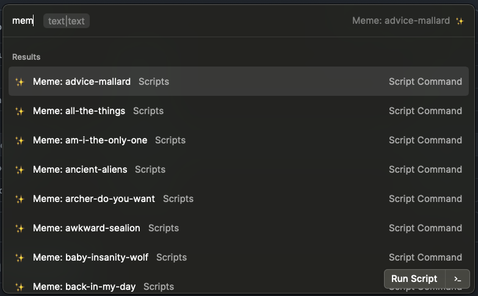

# Raycast Memes

Sometimes you need a meme and you need it fast. If you are using [Raycast](https://raycast.com/) (which I recommend over [Alfred](https://www.alfredapp.com/)), you can install these scripts to put a custom meme image in your clipboard.

## Setup

1. Clone this repo
2. Install [Go](https://golang.org/doc/install)
3. Install the [Meme CLI](https://github.com/nomad-software/meme)
4. Go to the extensions settings in Raycast (probably `cmd+space` the `Extensions`)
5. Press `cmd+n` to add a scripts folder, choose the `scripts` folder of this repo
6. All set, you can now type `Meme:` and you will see all the memes you have installed. Press enter on the one you want, then type in the text you want, enter again and the image is in your clipboard.
7. Bonus: Add a `|` character to the middle of the text if you want top and bottom
